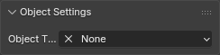

# Editor Objects
The SAST addon comes with multiple types of objects that are utilized for editing stage related files for Sonic Adventure and its sequel.

## General 
These properties are extended to all Mesh Objects within a Blender scene. These do not extend to any other Object type.

## Property Reference
Below is a list of the properties that are shared by all Editor Objects.

### SAST Properties

#### Object Type

This sets what the object represents in the scene. 

* None: This is the default for any mesh object in the scene. 
* [Set Object](set-objects.md): This will make the object act as a SET object in the scene. This will remove any existing modifiers for the object and replace it with either the loaded Geometry Node for the SET item in slot 0 or the default set object if nothing is loaded.
* Cam Object: This will convert the object to a Camera object in the scene. This will switch context based on which game is selected as the Camera objects between both titles are not the same. See [here](sa1cam-objects.md) for SA1 and [here](sa2cam-objects.md) for SA2.
* [Camera Point](sa2campoint-objects.md): **SA2 ONLY**, This will convert the object to a Camera point in the scene.

#### Export Properties
The following properties are all boolean properties that assign what files the object should be exported to. You can view a list of each Export Flag and info on what they export to in the table below.

=== "SA1"
    * Sonic: Exports to Sonic's SET or CAM layout.
    * Tails: Exports to Tails' SET or CAM layout.
    * Knuckles: Exports to Knuckles' SET or CAM layout.
    * Amy: Exports to Amy's SET or CAM layout.
    * Big: Exports to Big's SET or CAM layout.
    * Gamma: Exports to Gamma's SET or CAM layout.
    * Eggman: Exports to Eggman's SET or CAM layout. Not used in the base game.
    * Tikal: Exports to Tikal's SET or CAM layout. Not used in the base game.
    * Last: Exports for use in the Last Story. This works for all levels, so levels can have different layouts if visited when going to them during Super Sonic's story.

=== "SA2"
    * Single Player: Exports to the Single Player layout for the SET or CAM file.
    * Multiplayer: Exports to the Multiplayer layout for the SET or CAM file.
    * Hard Mode: Exports to the M5/Hard Mode layout for a SET file. Not available for Cameras.
    * Demo: Exports to the Demo playback layout for a CAM file. Not available for SET layouts.